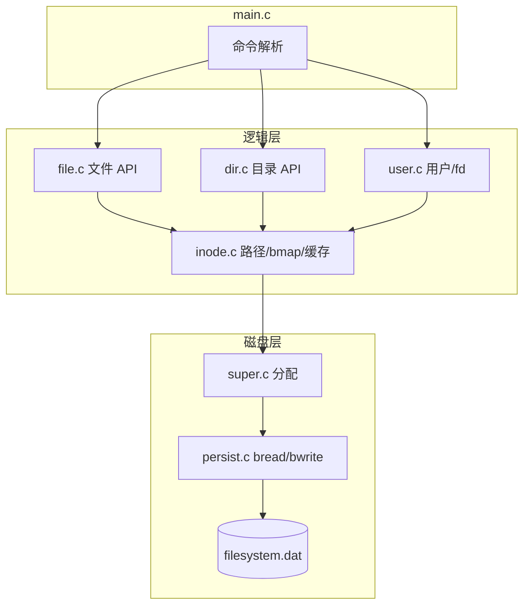

# VFS 项目读懂指南

从零开始理解本仓库：一个用 C 实现的、类 UNIX 的**虚拟文件系统**，数据持久化在宿主机上的单个 `.dat` 磁盘镜像文件中。

---

## 目录

1. [先建立直觉：三层结构](#1-先建立直觉三层结构)
2. [建议的阅读顺序](#2-建议的阅读顺序)
3. [磁盘布局](#3-磁盘布局)
4. [核心数据结构](#4-核心数据结构)
5. [源码模块地图](#5-源码模块地图)
6. [启动与持久化](#6-启动与持久化)
7. [空闲资源管理](#7-空闲资源管理)
8. [Inode 与块映射](#8-inode-与块映射)
9. [目录与路径解析](#9-目录与路径解析)
10. [文件读写与打开表](#10-文件读写与打开表)
11. [用户与权限](#11-用户与权限)
12. [命令到代码的映射](#12-命令到代码的映射)
13. [三条端到端流程](#13-三条端到端流程)
14. [系统限制一览](#14-系统限制一览)
15. [如何验证与调试](#15-如何验证与调试)
16. [与真实 UNIX 的异同](#16-与真实-unix-的异同)

---

## 1. 先建立直觉：三层结构

```
┌─────────────────────────────────────────────────────────┐
│  你输入的命令 (login, create, open, write, dir ...)    │  ← main.c 命令循环
├─────────────────────────────────────────────────────────┤
│  VFS 逻辑层                                              │
│  用户 / 打开文件表 / 路径解析 / 目录 / 权限 / inode 缓存   │  ← user.c file.c dir.c inode.c
├─────────────────────────────────────────────────────────┤
│  磁盘抽象层                                              │
│  超级块 / inode 分配 / 数据块分配 / 块读写                 │  ← super.c persist.c format.c
├─────────────────────────────────────────────────────────┤
│  宿主机文件 (如 filesystem.dat)                         │  ← 546 × 512 字节的“整块盘”
└─────────────────────────────────────────────────────────┘
```

**重要区分：**

| 概念                       | 含义                                                         |
| ------------------------ | ---------------------------------------------------------- |
| VFS 路径 `/usr1/hello.txt` | 虚拟文件系统里的逻辑路径                                               |
| `filesystem.dat`         | 真实存在于你电脑上的**一个二进制文件**，里面按块存放超级块、inode、数据                   |
| 普通 Windows 文件            | `create hello.txt` **不会**在桌面上生成 `hello.txt`，只会改 `.dat` 里的块 |

---

## 2. 建议的阅读顺序

按依赖关系由底向上读，每读完一层可对照 `验证指南.md` 跑几条命令。

| 顺序  | 文件                            | 关注点                                                 |
| --- | ----------------------------- | --------------------------------------------------- |
| ①   | `src/config.h`                | 所有容量常量：块数、inode 数、索引级数                              |
| ②   | `src/types.h`                 | `DiskInode`、`SuperBlock`、`DirEntry`、`MInode`、`User` |
| ③   | `src/globals.h` + `globals.c` | 全局变量：`g_sb`、`g_inode_hash`、`g_users`                |
| ④   | `src/persist.c`               | `bread` / `bwrite`：块号 → 文件偏移                        |
| ⑤   | `src/format.c`                | 格式化时如何造出根目录和超级块                                     |
| ⑥   | `src/super.c`                 | inode 栈、数据块组链接                                      |
| ⑦   | `src/inode.c`                 | `iget`/`iput`、`bmap`、`namei`、`dir_lookup`           |
| ⑧   | `src/dir.c`                   | 目录项增删、`mkdir`、`chdir`、`dir`                         |
| ⑨   | `src/file.c`                  | `create`/`open`/`read`/`write`/`delete`             |
| ⑩   | `src/user.c`                  | 登录、主目录、fd 表                                         |
| ⑪   | `src/main.c`                  | 命令解析与调度                                             |

头文件（`*.h`）与对应 `.c` 成对阅读即可。

---

## 3. 磁盘布局

定义在 `src/config.h`，共 **546 个块**，每块 **512 字节**。

```
块号     用途
────────────────────────────────────
0        未使用（保留）
1        超级块 SuperBlock（512 字节）
2–33     Inode 区（32 块 × 16 inode/块 = 512 个 inode）
34–545   数据区（512 个数据块）
────────────────────────────────────
总大小 ≈ 546 × 512 = 279,552 字节
```

### 3.1 Inode 在磁盘上的位置

Inode 编号 **从 1 开始**（0 表示“空目录项”）。第 `ino` 号 inode 位于：

```
块号 = INODE_AREA_START + (ino - 1) / INODES_PER_BLOCK
块内偏移 = ((ino - 1) % INODES_PER_BLOCK) × 32
```

根目录固定使用 **inode 1**（`ROOT_INO`）。

### 3.2 数据块编号

数据块号就是全局块号（34–545）。`bmap()` 根据文件内的**逻辑块号**（从 0 开始）算出对应的物理块号。

---

## 4. 核心数据结构

全部在 `src/types.h`，并有 `_Static_assert` 保证磁盘结构大小精确。

### 4.1 DiskInode（32 字节，磁盘上）

| 字段                  | 含义                                               |
| ------------------- | ------------------------------------------------ |
| `di_mode`           | 高 4 位：文件类型（`FT_REGULAR` / `FT_DIR`）；低 9 位：rwx 权限 |
| `di_nlink`          | 硬链接计数（目录被引用时递增）                                  |
| `di_uid` / `di_gid` | 所有者                                              |
| `di_size`           | 文件字节长度（目录则为目录项总字节数）                              |
| `di_addr[10]`       | **混合索引**：见下节                                     |

### 4.2 SuperBlock（512 字节，块 1）

| 字段 | 含义 |
|------|------|
| `s_nfree` / `s_free_inode[50]` | 空闲 inode 号栈（最多 50 个） |
| `s_nfree_block` / `s_free_block[50]` | 空闲数据块栈（组链接辅助） |
| `s_fmod` | 超级块是否被修改 |
| `s_inode_area_*` / `s_data_area_*` | 各区域起止描述 |

### 4.3 DirEntry（16 字节）

- `de_name[14]`：文件名（以 `\0` 结尾，最长有效名 14 字符）
- `de_ino`：inode 号；**0 表示该槽位空闲**

### 4.4 MInode（内存 inode）

磁盘 inode 的**缓存副本**，带：

- `mi_count`：引用计数（`iget` +1，`iput` -1，为 0 时写回并释放）
- `mi_flag`：`IUPD`（需写回）、`ILOCKED` 等
- 挂在 **128 桶** 的哈希表 `g_inode_hash[]` 上

### 4.5 User 与 OpenFile

每个用户有：

- `u_ofile[MAX_OPEN_FILES]`：打开文件表（fd → `OpenFile`）
- `u_cwd_ino` / `u_cwd_path`：当前工作目录
- `u_home_ino`：首次登录时在根目录下创建的 `/usrN` 目录

`OpenFile` 保存：`o_inode`、`o_offset`（读写位置）、`o_flag`（读/写模式）。

---

## 5. 源码模块地图

```
src/
├── config.h      # 常量：块大小、区域划分、上限
├── types.h       # 磁盘/内存数据结构
├── globals.h/c   # 全局状态
├── persist.h/c   # 块 I/O、sb_load/sb_save、关闭镜像
├── format.h/c    # fs_format：初始化整块盘
├── super.h/c     # sb_ialloc/sb_balloc、组链接空闲块
├── inode.h/c     # iget/iput、bmap、namei、权限、dir_lookup
├── dir.h/c       # 目录项、mkdir/chdir/dir
├── file.h/c      # create/open/read/write/delete/seek
├── user.h/c      # login/logout、fd 分配
└── main.c        # CLI 入口
```

**依赖关系（简化）：**

```
main → file, dir, user, format
file, dir → inode → super, persist
user → inode, dir
format → super, persist
```

---

## 6. 启动与持久化

### 6.1 `main()` 做了什么

```c
// 伪代码摘要，见 src/main.c
if (block_init(fs_path) == 0) {
    sb_load();           // 从块 1 读超级块到 g_sb
    inode_hash_init();
    user_init();         // 内存里创建 usr1~usr8，密码 123
} else {
    fs_format();         // 创建并格式化新镜像
    user_init();
}
// 进入 while 循环读命令，直到 exit
inode_flush_all();
sb_save();
fs_shutdown();           // fclose 镜像文件
```

### 6.2 块读写

`persist.c` 中：

```c
fseek(g_fs_file, blkno * 512, SEEK_SET);
fread/fwrite(..., 512, ...);
```

每次 `bwrite` 会 `fflush`，因此多数写操作会立刻落到 `.dat`；退出时再统一 `sb_save()` 写超级块。

### 6.3 格式化 `fs_format()` 步骤

1. 创建/截断宿主机文件，**所有块清零**
2. 初始化 `g_sb`，把所有 inode（2..512）和数据块（34..545）放入空闲结构
3. **保留 inode 1** 给根目录；分配一个数据块；写入 `.` 和 `..`
4. `sb_save()` 写超级块

---

## 7. 空闲资源管理

### 7.1 空闲 Inode（栈 + 扫描）

- 超级块里维护最多 **50** 个空闲 inode 号
- `sb_ialloc()`：栈空则**扫描 inode 区**，找 `di_mode == 0` 的项 refill
- `sb_ifree()`：把磁盘 inode 清零；栈未满则压栈

`ialloc()` 在 `sb_ialloc()` 之后还会清零新 inode 内容。

### 7.2 空闲数据块（组链接，每组 50）

思路类似 UNIX 空闲块管理：

- 平时从 `s_free_block[]` 栈顶弹出块号
- 栈弹空时，弹出的块号指向的块里存着**下一组**空闲块列表（块首 `uint16_t` 为个数，后跟块号）
- `sb_bfree()`：栈满时，把当前栈**写入**刚释放的块，形成新组头，栈只保留刚释放的这一块

格式化时 `sb_init_free_blocks()` 对每个数据块调用 `sb_bfree()`，从而建好整条空闲链。

---

## 8. Inode 与块映射

### 8.1 混合索引（`di_addr[10]`）

```
addr[0..7]   → 8 个直接块（逻辑块 0–7）
addr[8]      → 一级间接块（逻辑块 8–263，每间接块 256 项）
addr[9]      → 二级间接块（再套一层间接）
```

常量（`config.h`）：

- `ADDRS_PER_BLOCK = 256`（512 / 2）
- 小文件：≤ 8 块 × 512 = **4 KB** 仅用直接索引
- 单级间接最多再扩 **256 块**
- 二级间接再扩 **256×256 块**（课程规模下足够）

### 8.2 `bmap(ip, logical_block, alloc)`

| `alloc` | 行为 |
|---------|------|
| 0 | 只查询；块不存在返回 0 |
| 1 | 需要时 `sb_balloc()` 并更新 inode（置 `IUPD`） |

读文件用 `alloc=0`；写文件、扩展目录用 `alloc=1`。

### 8.3 `iget` / `iput` / `iupdat`

```
iget(ino)  → 哈希命中则 mi_count++；否则读盘、插入哈希
iput(ip)   → mi_count--；为 0 时若 IUPD 则写盘 inode，从哈希删除并 free
```

打开的文件在 `OpenFile` 里持有 `MInode*`，`close` 时会 `iput`。

删除文件时 `ifree()` → `free_all_blocks()` 递归释放直接/间接块。

---

## 9. 目录与路径解析

### 9.1 目录在磁盘上的样子

目录**也是文件**：`di_mode` 含 `FT_DIR`，内容是连续的 `DirEntry` 数组。

- 新建目录必有 `.`（自己）和 `..`（父目录）
- `di_size` 为有效目录项占用的字节数
- 查找空闲槽：`iname()` 找 `de_ino==0`；否则在 `size` 处扩展（最多 128 项）

### 9.2 `dir_lookup(dp, name)`

在目录 inode `dp` 的数据块里线性扫描，匹配则 `iget(de_ino)` 返回子 inode。

### 9.3 `namei_parent` / `namei`

```
绝对路径 /a/b/c  → 从 ROOT_INO(1) 开始
相对路径         → 从当前用户 u_cwd_ino 开始

namei_parent:
  遍历除最后一段外的所有组件 → dir_lookup
  最后一段放入 basename 输出
  返回父目录 MInode（仍持有引用）

namei:
  parent = namei_parent
  target = dir_lookup(parent, basename)
```

中间目录会检查**执行权限**（`access_check(..., 0x04)`），否则无法穿过。

---

## 10. 文件读写与打开表

### 10.1 创建 `fs_create`

1. `namei_parent` 找父目录
2. `dir_lookup` 确认不存在
3. `ialloc()` → 设置 `di_mode/uid/size`
4. `dir_add_entry(parent, basename, new_ino)`

### 10.2 打开 `fs_open`

1. `namei(path)`；不存在且带 `O_CREAT` 则先 `fs_create`
2. 不能打开目录
3. `access_check` 读/写权限
4. `user_alloc_fd()`，设置 `o_offset`（`O_APPEND` 则移到文件尾）

### 10.3 读 `fs_read`

按 `o_offset` 循环：

```
logical_block = offset / 512
phys = bmap(ip, logical_block, 0)
从 phys 块内拷贝，更新 o_offset
```

### 10.4 写 `fs_write`

与读类似，但 `bmap(..., 1)` 可分配新块；块内可能 **read-modify-write**（只写尾部一部分时先读整块）；最后若 `offset > di_size` 则扩大 `di_size`。

### 10.5 删除 `fs_delete`

- 必须是普通文件、权限允许、**不能被打开**（检查各用户 `u_ofile`）
- `dir_remove_entry` + `ifree`（释放数据块并归还 inode）

---

## 11. 用户与权限

### 11.1 用户表

- `user_init()`：创建 **usr1–usr8**，密码均为 `123`，`uid` 为 1–8
- 用户数据在**内存**中，不写入 `.dat`（每次启动重新 `user_init`）
- 但用户创建的 **/usrN 目录** 在磁盘上，下次登录会 `namei("/usrN")` 复用

### 11.2 登录 `fs_login`

1. 校验密码
2. 若 `u_home_ino == 0`：在根目录创建 `/username`（权限 **0700**，仅属主 rwx）
3. 设置 `u_cwd` 到主目录

### 11.3 权限 `access_check`

- `uid == 0` 视为超级用户（本项目中普通用户 uid 从 1 开始，**没有内置 uid=0 的登录账号**）
- 属主：检查 `PERM_IRUSR` / `PERM_IWUSR` / `PERM_IXUSR`
- 非属主：简化为只检查 **other** 位（`PERM_IROTH` 等）

因此 **usr2 默认不能进入 usr1 的 0700 主目录**，实现用户隔离。

---

## 12. 命令到代码的映射

| 命令 | 实现函数 | 文件 |
|------|----------|------|
| `login` | `fs_login` | user.c |
| `logout` | `fs_logout` | user.c |
| `format` | `fs_format` | format.c |
| `create` | `fs_create` | file.c |
| `open` | `fs_open` | file.c |
| `close` | `fs_close` | file.c |
| `read` | `fs_read` | file.c |
| `write` | `fs_write` | file.c |
| `seek` | `fs_lseek` | file.c |
| `delete` / `rm` | `fs_delete` | file.c |
| `mkdir` | `fs_mkdir` | dir.c |
| `chdir` / `cd` | `fs_chdir` | dir.c |
| `dir` / `ls` | `fs_dir` | dir.c |
| `exit` / `quit` | `main` 收尾 | main.c |

命令行参数在 `main.c` 的 `next_arg()` 中按空格切分。

---

## 13. 三条端到端流程

### 13.1 写入 `hello.txt` 的完整路径

```
login usr1 123
create hello.txt          → fs_create → ialloc + dir_add_entry
open hello.txt w            → fs_open → namei + fd=0, o_offset=0
write 0 Hello               → fs_write → bmap(alloc) → bwrite 数据块
close 0                     → iupdat inode → iput
exit                        → inode_flush_all + sb_save
```

数据最终在：`hello.txt` 的 inode → `di_addr[0]` 指向的数据块 → 镜像文件对应偏移。

### 13.2 访问 `/docs/manual/readme.txt`

```
namei("/docs/manual/readme.txt")
  namei_parent → 走到 /docs/manual，basename="readme.txt"
  dir_lookup(/docs/manual, "readme.txt") → iget(文件inode)
```

每一级 `dir_lookup` 内部都会对父目录调用 `bmap` 读目录数据块。

### 13.3 再次启动后数据仍在

```
block_init("filesystem.dat")  // 打开已有文件
sb_load()                     // 恢复空闲栈、区域信息
// 用户表重新初始化，但磁盘上的 /usr1、文件、目录都在
login usr1 123                // namei("/usr1") 找到已有主目录
```

---

## 14. 系统限制一览

| 项目 | 值 | 定义位置 |
|------|-----|----------|
| 块大小 | 512 B | `BLOCK_SIZE` |
| 总块数 | 546 | `TOTAL_BLOCKS` |
| Inode 总数 | 512 | `TOTAL_INODES` |
| 数据块数 | 512 | `DATA_AREA_BLOCKS` |
| 文件名长度 | 14 | `DIR_ENTRY_NAME_LEN` |
| 路径长度 | 256 | `MAX_PATH_LEN` |
| 单目录最大项 | 128 | `DIR_MAX_ENTRIES` |
| 每用户最多打开文件 | 20 | `MAX_OPEN_FILES` |
| 注册用户 | usr1–usr8 | user.c |

---

## 15. 如何验证与调试

### 15.1 编译与运行

```powershell
cd d:\os_ks
make
.\vfs.exe mydisk.dat
```

### 15.2 文档与脚本

| 文档 | 用途 |
|------|------|
| `验证指南.md` | 12 类命令的逐步验收 |
| `测试指南.md` | 登录、读写、隔离、持久化等场景 |
| `CLAUDE.md` | 给 AI/维护者的速查 |

管道批量测试：

```powershell
.\vfs.exe test.dat < commands.txt
```

### 15.3 调试建议

- `make debug`：AddressSanitizer，查内存越界
- 在 `bread`/`bwrite`、`sb_balloc`、`namei` 处下断点
- 观察 `.dat` 文件大小是否约为 279552 字节
- 格式化会**清空**该镜像：`format` 或删除 `.dat` 后重启

### 15.4 推荐阅读时配合的实验

1. 格式化后只 `login`，用十六进制编辑器看块 1（超级块）和根目录数据块
2. `create` 一个小文件，记下打印的 inode 号，计算其在 inode 区的文件偏移
3. 两个用户分别 `create`，验证 `dir /usr2` 失败（隔离）
4. 退出再启动，确认文件仍在

---

## 16. 与真实 UNIX 的异同

| 方面 | 本项目 | 真实 UNIX/Linux |
|------|--------|-----------------|
| 存储介质 | 单个 `.dat` 文件 | 分区 / 块设备 |
| 进程模型 | 单进程 CLI | 多进程 + 系统调用 |
| 打开文件表 | 每用户一份 | 每进程一份 + 全局 file 结构 |
| 用户账户 | 内存表，固定 8 用户 | `/etc/passwd`、UID 在磁盘 |
| 缓存 | inode 哈希，无块缓存 | buffer cache / page cache |
| 符号链接、硬链接 | 基本未实现 | 完整支持 |
| 并发 | 无锁、单线程 | 需 inode 锁、睡眠等 |

本项目的价值在于：**用可管理的代码量**，把 inode、目录项、混合索引、空闲块管理、路径解析和简单权限串成一条完整链路——这正是操作系统课程里文件系统章节的缩影。

---

## 附录：一张总览图



---

**下一步**：打开 `src/config.h` 和 `src/types.h`，对照本文第 3、4 节；然后读 `persist.c` 和 `format.c`，跑一遍 `验证指南.md` 中的 `format` 与 `login` 测试。遇到具体函数不懂时，在对应 `.c` 文件中搜索函数名即可。
